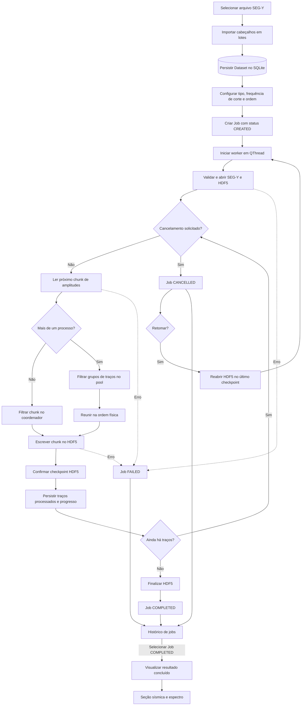
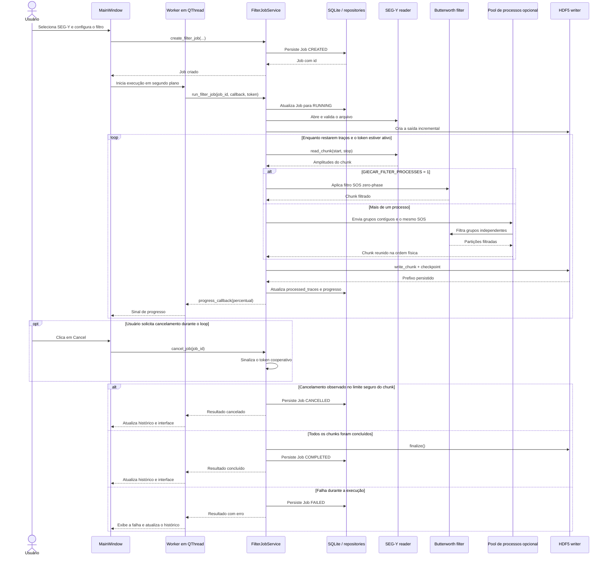

# GIECAR Seismic

## Visão geral

GIECAR Seismic é uma aplicação desktop em Python e PyQt5 para filtrar arquivos
sísmicos SEG-Y com filtros Butterworth. O fluxo principal é simples: a pessoa
seleciona um arquivo, configura o filtro, acompanha o processamento e abre o
resultado para comparar os dados originais e filtrados.

Arquivos sísmicos podem ter dezenas de gigabytes. Por isso, a aplicação não carrega
o volume inteiro na memória. Metadados e amplitudes são lidos em partes limitadas,
e o resultado é gravado aos poucos em HDF5. O processamento roda em uma QThread
para que a interface continue respondendo durante leituras, cálculos e escritas.

## Funcionalidades

### Funcionalidades principais

- Importação de metadados SEG-Y sem leitura de amplitudes.
- Suporte a malhas irregulares: a quantidade física de traços vem de
  `segy.tracecount`, sem assumir `inlines × crosslines`.
- Filtro Butterworth Low-pass (High-cut) como comportamento padrão da prova.
- Processamento com fase zero e representação SOS, usando SciPy.
- Leitura das amplitudes em chunks e escrita incremental em HDF5.
- Execução em segundo plano, progresso por traço e cancelamento cooperativo.
- Histórico de conjuntos de dados e jobs persistido em SQLite.
- Estados explícitos para o job: `CREATED`, `RUNNING`, `COMPLETED`, `FAILED` e
  `CANCELLED`.

### Funcionalidades extras implementadas

- Filtros High-pass (Low-cut) e Band-pass (Low + High cut).
- Retomada de um job `CANCELLED` no próximo traço após o último checkpoint HDF5
  confirmado, usando o mesmo job e o mesmo arquivo de saída.
- Multiprocessing opcional apenas na filtragem de grupos de traços dentro de cada
  chunk, preservando a ordem física na saída.
- Viewer sísmico para linhas inline e crossline, com dados originais, filtrados e
  diferença.
- Exibição raster ou wiggle, ajuste de ganho, clip e mapa de cores.
- Renderização com PyQtGraph ou Matplotlib.
- Espectro do traço selecionado em escala linear ou dB, com frequências de corte
  e resposta teórica do filtro.
- Janela de Spectrum maior e não modal, sincronizada com a seleção do viewer.

## Arquitetura da solução

O código está organizado em quatro camadas:

| Camada | Responsabilidade |
| --- | --- |
| `domain` | Entidades, enums e regras de transição de estado. |
| `application` | Casos de uso, validações, cálculo do filtro e coordenação dos jobs. |
| `infrastructure` | Leitura SEG-Y, arquivos HDF5 e repositórios SQLite/SQLAlchemy. |
| `ui` | Janelas PyQt5, workers, sinais e renderizadores. |

A interface recebe serviços prontos e não contém a regra de negócio. O worker não
acessa widgets: ele executa o serviço na QThread e devolve progresso e resultado por
sinais. Essa separação permite testar domínio e aplicação sem abrir a interface.

Há dois fluxos de leitura limitada:

- **Importação:** cabeçalhos SEG-Y → lotes de até 4096 traços → metadados. As listas
  temporárias dependem do lote; somente os identificadores distintos de inline e
  crossline são mantidos. Nenhuma amplitude é lida.
- **Processamento:** amplitudes SEG-Y → chunk configurável → Butterworth sequencial
  ou em pool de processos → escrita HDF5 → checkpoint → atualização do job.

A memória de trabalho da importação é
`O(batch_size + unique_inlines + unique_crosslines)`. Durante a filtragem, é
`O(chunk_size × n_samples)` no modo sequencial. No modo paralelo, há
cópias para serialização e partições nos subprocessos, então o uso também cresce
com a quantidade de processos. Em nenhum modo a memória depende do total de
traços do volume: somente um chunk lógico fica em processamento por vez.

## Fluxograma da solução



## Diagrama de sequência



## Como rodar

### Requisitos

- Python 3.12 ou superior.
- [uv](https://docs.astral.sh/uv/).
- Ambiente gráfico compatível com PyQt5 para abrir a aplicação.

Na raiz do repositório, sincronize o ambiente e as dependências:

```bash
uv sync
```

Execute a aplicação:

```bash
uv run giecar-seismic
```

Por padrão, a filtragem usa um processo. Para distribuir os grupos de traços de
cada chunk entre dois processos:

```bash
GIECAR_FILTER_PROCESSES=2 uv run giecar-seismic
```

O valor deve ser um inteiro entre `1` e a quantidade de CPUs disponíveis. Valores
inválidos produzem um erro claro antes da criação da interface. A leitura SEG-Y,
a escrita HDF5, o checkpoint, o SQLite e os sinais da interface continuam no
processo coordenador.

Os dados locais são criados em `~/.giecar-seismic/`:

- `giecar.sqlite`: conjuntos de dados, jobs e índice de geometria;
- `outputs/`: resultados HDF5.

O projeto não usa Alembic. `create_schema()` cria tabelas ausentes, mas não migra
um banco de uma versão anterior. Para uma avaliação limpa, remova ou mova
conscientemente um banco antigo antes de iniciar a versão atual.

## Como testar

A suíte está dividida por escopo:

- `tests/unit/`: domínio, aplicação e interface isolados com fakes;
- `tests/integration/`: SQLite, SQLAlchemy, SEG-Y e HDF5 reais em arquivos
  temporários;
- `tests/e2e/`: fluxos completos da importação até a reabertura do resultado.

Execute todos os testes:

```bash
uv run pytest
```

Execute as verificações de estilo e tipos:

```bash
uv run ruff check .
uv run mypy src/giecar_seismic
```

O E2E principal cria um SEG-Y irregular temporário, importa e persiste o dataset,
executa a filtragem em chunks, grava HDF5, fecha os recursos, reabre SQLite/HDF5 e
compara numericamente o resultado. Há também testes para cancelamento, retomada,
memória limitada na importação, renderizadores e comunicação da interface.

## Trade-offs e decisões

| Contexto | Decisão | Vantagem | Custo ou limitação |
| --- | --- | --- | --- |
| Arquivos sísmicos podem superar 25 GB. | Ler cabeçalhos e amplitudes em partes limitadas. | O pico de memória não depende do volume completo. | Há mais coordenação de lotes e mais chamadas de I/O. |
| Filtragem e I/O podem demorar. | Executar o serviço em worker/QThread. | A interface continua responsiva e pode solicitar cancelamento. | O ciclo de vida da thread e dos sinais precisa ser controlado. |
| Traços de um chunk são independentes durante o filtro. | Permitir um `ProcessPoolExecutor` com contexto `spawn`, ativado por variável de ambiente. | Pode usar mais de um núcleo sem compartilhar SEG-Y, HDF5, SQLite ou PyQt5. | Serialização e cópias aumentam tempo e memória; o ganho depende da máquina, do chunk e do número de amostras. |
| Datasets, jobs e geometria precisam sobreviver ao fechamento. | Usar SQLite com SQLAlchemy. | Banco local simples, consultas claras e domínio sem dependência do ORM. | Não há migrações automáticas; mudanças de schema exigem ação consciente. |
| A saída é grande e precisa ser gravada aos poucos. | Usar HDF5 com dataset extensível. | Escrita incremental, leitura seletiva e um arquivo por job. | O flush por chunk tem custo e o arquivo exige consistência cuidadosa na retomada. |
| Um processamento cancelado pode já ter horas de trabalho. | Confirmar checkpoint por chunk e permitir a retomada de `CANCELLED`. | Evita repetir CPU e I/O já concluídos. | HDF5 e SQLite não formam uma transação única; divergências precisam ser reconciliadas ou rejeitadas. |
| A malha pode ter posições ausentes. | Abrir SEG-Y com `ignore_geometry=True` e indexar traços físicos. | Malhas irregulares continuam válidas. | O índice de geometria precisa ser construído separadamente. |

### Multiprocessing: quando usar

O pool nasce uma vez por execução do job e é encerrado em conclusão, falha ou
cancelamento. Cada chunk é dividido em poucos grupos contíguos; os resultados são
reunidos na mesma ordem antes da escrita. Cancelamento e resume continuam nas
fronteiras duráveis de chunk. O contexto `spawn` inicia subprocessos limpos, sem
copiar por `fork` o processo que já contém threads e objetos do PyQt5.

O recurso é opt-in porque nem todo dado se beneficia dele. Em uma medição local
com o SEG-Y deste repositório, usando 80 filtragens de um chunk real de `256 × 850`
amostras e três repetições, as medianas foram `0,3091 s` com 1 processo, `1,2282 s`
com 2 e `1,2826 s` com 4. A criação do pool foi incluída em cada repetição. Nesse
caso, a serialização custou mais que o paralelismo economizou. Traços mais longos
ou filtros mais caros podem mudar essa relação; por isso o padrão permanece `1`.
Como NumPy e SciPy também podem usar bibliotecas nativas com paralelismo interno,
aumentar o número de processos pode ainda causar disputa pelos mesmos núcleos.

### Por que HDF5?

HDF5 foi escolhido porque o projeto é uma aplicação desktop que produz arquivos
locais. Ele permite criar um dataset extensível, escrever cada chunk assim que é
filtrado e reabrir apenas os traços necessários no viewer. A integração com `h5py`
é direta e atende à exigência de persistência incremental em um único arquivo.

Zarr também seria uma alternativa válida, principalmente para armazenamento em
objetos, dados distribuídos ou processamento com vários processos. Para este
desafio, HDF5 trouxe uma solução menor e mais prática: execução local, um writer por
job e nenhuma infraestrutura adicional. A escolha não significa que HDF5 seja
melhor para todos os cenários; ele foi o formato mais adequado ao escopo adotado.

### Outras decisões científicas e de consistência

- O Low-pass continua sendo o padrão e preserva o contrato original.
- Low-pass, High-pass e Band-pass usam `scipy.signal.butter` com SOS e
  `sosfiltfilt`, mantendo filtragem com fase zero e traços independentes.
- Em Band-pass, a ordem informada é a ordem do protótipo passada ao SciPy; a ordem
  efetiva do filtro resultante é maior.
- No espectro em dB, original e filtrado usam a mesma referência: o pico do
  original. Isso mantém a atenuação visível. Um piso de -120 dB evita `log(0)`.
- A resposta teórica usa o mesmo SOS do processamento e um eixo Y separado.
- `processed_traces`, e não o percentual arredondado, define o ponto exato de
  retomada. O HDF5 é a autoridade do resultado físico já gravado.

## Simplificações e limitações assumidas

- Aplicação e armazenamento voltados para uso local em desktop.
- Sem multiprocessing, processamento distribuído ou armazenamento remoto.
- Sem Alembic; bancos antigos precisam ser atualizados ou recriados manualmente.
- Retomada somente para jobs `CANCELLED`, no mesmo HDF5. Jobs `FAILED` e `COMPLETED`
  não são retomados.
- A identidade do SEG-Y no resume usa tamanho e data de modificação, não hash do
  arquivo completo.
- O checkpoint garante que o prefixo pode ser visto ao reabrir o HDF5, mas não cria
  uma transação distribuída entre HDF5 e SQLite.
- O viewer carrega somente uma seção por vez; não há visualização do volume inteiro
  em memória.

## Resumo e melhorias futuras

As decisões centrais foram processar em partes, manter o trabalho pesado fora da
interface, persistir resultados incrementalmente e separar regras de negócio de
detalhes de UI e armazenamento. Os testes cobrem essas fronteiras com unidades
isoladas, integrações reais e fluxos E2E.

Melhorias futuras naturais seriam adicionar migrações de banco, oferecer ajustes de
chunk e processos na interface, reforçar a identificação do arquivo de origem e
avaliar Zarr se o projeto passar a usar armazenamento remoto ou processamento
distribuído.
