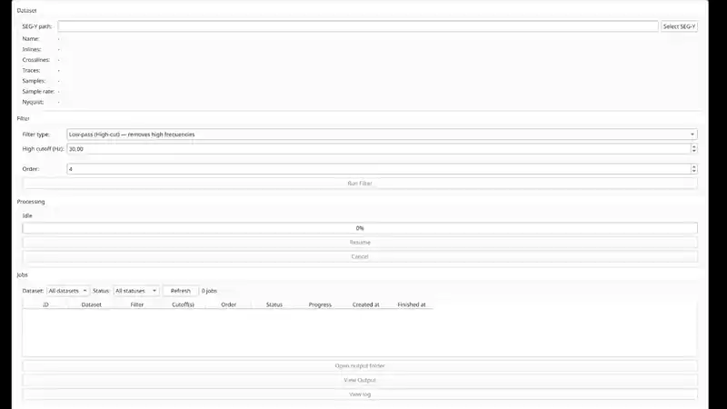
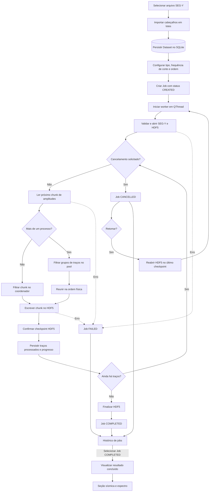
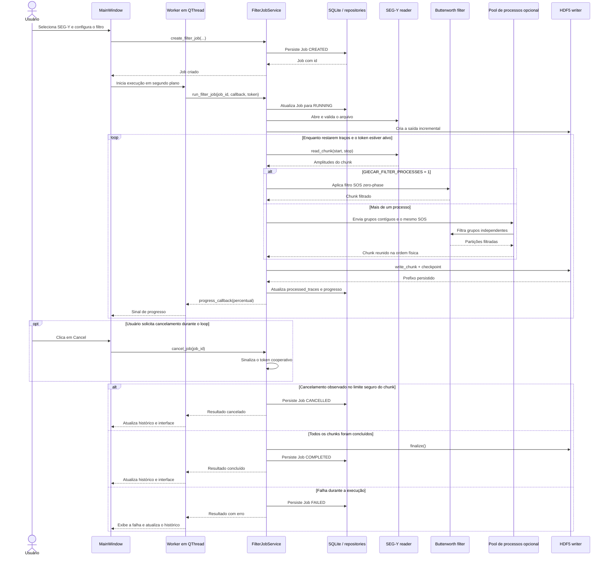

# GIECAR Seismic

[](https://github.com/Asunnya/giecar-seismic/actions/workflows/ci.yml)

## Visão geral

GIECAR Seismic é uma aplicação desktop em Python e PyQt5 para filtrar arquivos
sísmicos SEG-Y com filtros Butterworth. O fluxo principal é simples: a pessoa
seleciona um arquivo, configura o filtro, acompanha o processamento e abre o
resultado para comparar os dados originais e filtrados.

Arquivos sísmicos podem ter dezenas de gigabytes. Por isso, a aplicação não carrega
o volume inteiro na memória. Metadados e amplitudes são lidos em partes limitadas,
e o resultado é gravado aos poucos em HDF5. O processamento roda em uma QThread
para que a interface continue respondendo durante leituras, cálculos e escritas.

## Demonstração



Importação do SEG-Y, execução do filtro com cancelamento e retomada, e comparação
original × filtrado no visualizador (animação em 2× de velocidade).

## Funcionalidades

### Funcionalidades principais

- Importação de metadados SEG-Y sem leitura de amplitudes.
- Suporte a malhas irregulares: a quantidade física de traços vem de
  `segy.tracecount`, sem assumir `inlines × crosslines`.
- Filtro Butterworth Low-pass (High-cut) como comportamento padrão da prova.
- Processamento com fase zero e representação SOS, usando SciPy.
- Leitura das amplitudes em chunks e escrita incremental em HDF5.
- Execução em segundo plano, progresso por traço e cancelamento cooperativo.
- Histórico de conjuntos de dados e jobs persistido em SQLite.
- Estados explícitos para o job: `CREATED`, `RUNNING`, `COMPLETED`, `FAILED` e
  `CANCELLED`.

### Funcionalidades extras implementadas

- Filtros High-pass (Low-cut) e Band-pass (Low + High cut).
- Retomada de um job `CANCELLED` no próximo traço após o último checkpoint HDF5
  confirmado, usando o mesmo job e o mesmo arquivo de saída.
- Multiprocessing opcional apenas na filtragem de grupos de traços dentro de cada
  chunk, preservando a ordem física na saída.
- Viewer sísmico para linhas inline e crossline, com dados originais, filtrados e
  diferença; **View Output** abre direto na seção filtrada.
- Exibição raster ou wiggle, ajuste de ganho, clip e mapa de cores.
- Renderização com PyQtGraph ou Matplotlib.
- **QC espectral por região:** um clique na seção mostra o traço (amplitude ×
  tempo, original vs filtrado) e o seu espectro; um segundo clique estende a
  análise ao intervalo entre os dois cliques (em qualquer ordem; um terceiro
  clique recomeça). Todo traço presente no intervalo entra; posições ausentes do
  levantamento são excluídas e informadas no painel. O painel da direita mostra
  uma curva agregada original e uma filtrada — a média dos espectros de amplitude
  dos traços (ver decisão abaixo) — em escala linear ou dB, com as frequências de
  corte e a resposta teórica do filtro; **Open Spectrum** abre a mesma região em
  uma janela maior. O cálculo roda em segundo plano sobre a seção já carregada,
  sem novas leituras de arquivo.
- **Preview** dos parâmetros antes de rodar o job: o botão **Preview** abre o
  viewer com o dataset importado e aplica o filtro configurado em memória apenas à
  seção em tela, com o mesmo projeto de filtro do job. Nada é persistido: nenhum
  job é criado e nenhum HDF5 é escrito. Os parâmetros passam pela mesma validação
  do job, e um teste end-to-end confirma que o preview é igual ao resultado de um
  job concluído com os mesmos parâmetros.
- Log de execução persistido por Job: um arquivo `job_<id>.log` append-only em
  `~/.giecar-seismic/logs/`, escrito com a biblioteca padrão `logging`, que
  permanece após reiniciar a aplicação e continua recebendo os eventos de uma
  retomada. Só eventos de ciclo de vida são gravados (criação, início, pedido e
  efetivação de cancelamento, retomada, conclusão, falha); não há linha por trace
  nem por chunk, então o tamanho do log não depende do tamanho do survey. O botão
  **View log** do histórico abre o arquivo em um diálogo somente leitura, lido
  fora da thread da interface.

## Arquitetura da solução

O código está organizado em quatro camadas:

| Camada | Responsabilidade |
| --- | --- |
| `domain` | Entidades, enums e regras de transição de estado. |
| `application` | Casos de uso, validações, cálculo do filtro e coordenação dos jobs. |
| `infrastructure` | Leitura SEG-Y, arquivos HDF5 e repositórios SQLite/SQLAlchemy. |
| `ui` | Janelas PyQt5, workers, sinais e renderizadores. |

A interface recebe serviços prontos e não contém a regra de negócio. O worker não
acessa widgets: ele executa o serviço na QThread e devolve progresso e resultado por
sinais. Essa separação permite testar domínio e aplicação sem abrir a interface.

Há dois fluxos de leitura limitada:

- **Importação:** cabeçalhos SEG-Y → lotes de até 4096 traços → metadados. As listas
  temporárias dependem do lote; somente os identificadores distintos de inline e
  crossline são mantidos. Nenhuma amplitude é lida.
- **Processamento:** amplitudes SEG-Y → chunk configurável → Butterworth sequencial
  ou em pool de processos → escrita HDF5 → checkpoint → atualização do job.

A memória de trabalho da importação é
`O(batch_size + unique_inlines + unique_crosslines)`. Durante a filtragem, é
`O(chunk_size × n_samples)` no modo sequencial. No modo paralelo, há
cópias para serialização e partições nos subprocessos, então o uso também cresce
com a quantidade de processos. Em nenhum modo a memória depende do total de
traços do volume: somente um chunk lógico fica em processamento por vez.

## Fluxograma da solução



## Diagrama de sequência



## Como rodar

### Requisitos

- Python 3.12.
- Linux x86_64, Windows x86_64 ou macOS (Intel ou Apple Silicon).
- [uv](https://docs.astral.sh/uv/).
- Ambiente gráfico compatível com PyQt5 para abrir a aplicação.

Esses ambientes estão declarados no `pyproject.toml`, e o `uv.lock` é resolvido
para todos eles, de modo que cada plataforma receba dependências binárias com wheel
disponível.

Na raiz do repositório, sincronize o ambiente e as dependências:

```bash
uv sync
```

Execute a aplicação:

```bash
uv run giecar-seismic
```

Por padrão, a filtragem usa um processo. Para distribuir os grupos de traços de
cada chunk entre dois processos:

```bash
GIECAR_FILTER_PROCESSES=2 uv run giecar-seismic
```

O valor deve ser um inteiro entre `1` e a quantidade de CPUs disponíveis. Valores
inválidos produzem um erro claro antes da criação da interface. A leitura SEG-Y,
a escrita HDF5, o checkpoint, o SQLite e os sinais da interface continuam no
processo coordenador.

Os dados locais são criados em `~/.giecar-seismic/`:

- `giecar.sqlite`: conjuntos de dados, jobs e índice de geometria;
- `outputs/`: resultados HDF5;
- `logs/`: um `job_<id>.log` por job, com os eventos de execução.

O projeto não usa Alembic. `create_schema()` cria tabelas ausentes, mas não migra
um banco de uma versão anterior. Para uma avaliação limpa, remova ou mova
conscientemente um banco antigo antes de iniciar a versão atual.

## Releases

Releases são criadas a partir de tags explícitas `vMAJOR.MINOR.PATCH` (por exemplo
`v0.1.0` para a versão atual, `0.1.0`). Não há incremento automático de versão.

Fluxo para publicar uma versão:

1. Garanta que o CI de `master` está verde.
2. Ajuste `[project].version` no `pyproject.toml`.
3. Atualize o `uv.lock` se a mudança de metadados exigir (`uv lock`).
4. Faça commit e push.
5. Aguarde o CI de `master`.
6. Crie uma tag anotada `vX.Y.Z` no commit desejado.
7. Faça push da tag.
8. O GitHub Actions (`.github/workflows/release.yml`) valida a tag (formato,
   igualdade com a versão do `pyproject.toml`, commit contido em `master`,
   `uv.lock` consistente), roda a suíte completa em Linux, Windows e macOS,
   constrói o pacote, testa a instalação do wheel em um ambiente limpo e cria
   a GitHub Release.

Cada release contém o wheel, a distribuição de código-fonte (sdist) e um
`SHA256SUMS`. Não são instaladores nativos para Windows, macOS ou Linux.

### Instalar a partir de uma release

Requer Python 3.12. Baixe o arquivo `.whl` da release desejada e instale em um
ambiente virtual:

```bash
python -m venv giecar-env
source giecar-env/bin/activate        # Windows: giecar-env\Scripts\activate
pip install giecar_seismic-0.1.0-py3-none-any.whl
giecar-seismic
```

Ou, com `uv`, sem criar o ambiente manualmente:

```bash
uv tool install giecar_seismic-0.1.0-py3-none-any.whl
giecar-seismic
```

Para conferir o download, compare o hash com o `SHA256SUMS` da release
(`sha256sum -c SHA256SUMS` no Linux/macOS; `Get-FileHash` no PowerShell).

## Log de execução por Job

Cada job tem um único arquivo de log em `~/.giecar-seismic/logs/job_<id>.log`,
criado no primeiro evento e aberto sempre em modo append. O job é o identificador
da trajetória inteira: uma retomada continua escrevendo no mesmo arquivo, e o
conteúdo permanece após fechar e abrir a aplicação. Só o processo coordenador
escreve; os subprocessos do multiprocessing nunca tocam no arquivo.

Cada linha tem data e hora, nível e o código do evento seguido de uma mensagem:

```
2026-09-12 14:02:10 INFO JOB_CREATED - Job criado para o dataset 1 com Low-pass, cutoff 30 Hz, ordem 4.
2026-09-12 14:02:15 INFO RUN_STARTED - Processamento iniciado: dataset 1, Low-pass, cutoff 30 Hz, ordem 4, chunk de 256 traces, 1 processo(s).
2026-09-12 14:05:33 WARNING CANCEL_REQUESTED - Cancelamento solicitado; será atendido na próxima fronteira de chunk.
2026-09-12 14:05:34 WARNING JOB_CANCELLED - Processamento cancelado após 43520 de 288694 traces.
2026-09-12 15:10:07 INFO RESUME_STARTED - Processamento retomado a partir do trace 43520 de 288694 (retomada #1).
2026-09-12 15:48:53 INFO JOB_COMPLETED - Processamento concluído: 288694 traces. Saída: ~/.giecar-seismic/outputs/job-42.h5
```

Eventos registrados: `JOB_CREATED`, `RUN_STARTED`, `CANCEL_REQUESTED` (somente
quando o pedido é aceito), `JOB_CANCELLED`, `RESUME_STARTED`, `JOB_COMPLETED`
(somente depois de o HDF5 ser finalizado) e `JOB_FAILED` (com a mensagem de erro
curta, sem traceback). Não há linha por trace, por chunk nem por percentual.

O log é observabilidade, não fonte de verdade: o estado do job continua no SQLite.
Se o arquivo não puder ser criado ou escrito, o problema é reportado pelo `logging`
padrão do processo e o job segue normalmente, sem mudar resultado, checkpoint ou
estado. Na tela de histórico, o botão **View log** lê o arquivo fora da thread da
interface e o mostra em um diálogo somente leitura.

## Como testar

As mesmas verificações rodam no GitHub Actions a cada push e pull request, em
Linux, Windows e macOS: lint, tipos e a suíte completa de testes.

A suíte está dividida por escopo:

- `tests/unit/`: domínio, aplicação e interface isolados com fakes;
- `tests/integration/`: SQLite, SQLAlchemy, SEG-Y e HDF5 reais em arquivos
  temporários;
- `tests/e2e/`: fluxos completos da importação até a reabertura do resultado.

Execute todos os testes:

```bash
uv run pytest
```

Execute as verificações de estilo e tipos:

```bash
uv run ruff check .
uv run mypy src/giecar_seismic
```

O E2E principal cria um SEG-Y irregular temporário, importa e persiste o dataset,
executa a filtragem em chunks, grava HDF5, fecha os recursos, reabre SQLite/HDF5 e
compara numericamente o resultado. Há também testes para cancelamento, retomada,
memória limitada na importação, renderizadores e comunicação da interface.

### Multiprocessing: quando usar

O pool nasce uma vez por execução do job e é encerrado em conclusão, falha ou
cancelamento. Cada chunk é dividido em poucos grupos contíguos; os resultados são
reunidos na mesma ordem antes da escrita. Cancelamento e resume continuam nas
fronteiras duráveis de chunk. O contexto `spawn` inicia subprocessos limpos, sem
copiar por `fork` o processo que já contém threads e objetos do PyQt5.

O recurso é opt-in porque nem todo dado se beneficia dele. Em uma medição local
com o SEG-Y deste repositório, usando 80 filtragens de um chunk real de `256 × 850`
amostras e três repetições, as medianas foram `0,3091 s` com 1 processo, `1,2282 s`
com 2 e `1,2826 s` com 4. A criação do pool foi incluída em cada repetição. Nesse
caso, a serialização custou mais que o paralelismo economizou. Traços mais longos
ou filtros mais caros podem mudar essa relação; por isso o padrão permanece `1`.
Como NumPy e SciPy também podem usar bibliotecas nativas com paralelismo interno,
aumentar o número de processos pode ainda causar disputa pelos mesmos núcleos.

### Benchmark de memória

A aplicação usa **streaming**: lê 256 traços, aplica o filtro e persiste o chunk
antes de seguir. O [notebook de benchmark](notebooks/02_memory_benchmark.ipynb)
compara esse pipeline com uma referência ingênua que mantém todo o prefixo e seu
resultado na memória. Cada medição roda em um processo isolado e usa o pico de
memória residente reportado pelo sistema operacional: `ru_maxrss` no Linux e no
macOS, `PeakWorkingSetSize` (psapi) no Windows.

No SEG-Y real de 288.694 traços e 850 amostras, as medianas para 4.096, 16.384 e
65.536 traços foram, respectivamente, `197,6`, `445,2` e `1.435,2 MB` na abordagem
ingênua. O streaming ficou em `165,7 MB` nos três casos, igual ao baseline mediano
das bibliotecas nesse ambiente. Isso indica que seus chunks não elevaram o pico já
existente; não significa ausência de memória de trabalho. O caso ingênuo foi
limitado a subconjuntos seguros, pois carregar o survey completo apenas para
provocar consumo seria desnecessário e arriscado.

### Por que HDF5?

HDF5 foi escolhido porque o projeto é uma aplicação desktop que produz arquivos
locais. Ele permite criar um dataset extensível, escrever cada chunk assim que é
filtrado e reabrir apenas os traços necessários no viewer. A integração com `h5py`
é direta e atende à exigência de persistência incremental em um único arquivo.

Zarr também seria uma alternativa válida, principalmente para armazenamento em
objetos, dados distribuídos ou processamento com vários processos. Para este
desafio, HDF5 trouxe uma solução menor e mais prática: execução local, um writer por
job e nenhuma infraestrutura adicional. A escolha não significa que HDF5 seja
melhor para todos os cenários; ele foi o formato mais adequado ao escopo adotado.

### Outras decisões científicas e de consistência

- O Low-pass continua sendo o padrão e preserva o contrato original.
- Low-pass, High-pass e Band-pass usam `scipy.signal.butter` com SOS e
  `sosfiltfilt`, mantendo filtragem com fase zero e traços independentes.
- Em Band-pass, a ordem informada é a ordem do protótipo passada ao SciPy; a ordem
  efetiva do filtro resultante é maior.
- No espectro em dB, original e filtrado usam a mesma referência: o pico do
  original. Isso mantém a atenuação visível. Um piso de -120 dB evita `log(0)`.
- A resposta teórica usa o mesmo SOS do processamento e um eixo Y separado.
- A unidade de QC espectral é uma **região** contígua da seção exibida, não um
  traço isolado. O espectro regional é `mean_i |FFT(traço_i)|`, para original e
  filtrado separadamente, **nunca** `|FFT(mean_i traço_i)|`: a média no domínio
  do tempo deixa traços vizinhos se cancelarem por fase e suprime conteúdo
  espectral real. A média é feita em magnitude linear, em lotes de 64 traços
  (memória temporária limitada pelo lote, não pelo tamanho da região), e só então
  convertida para dB; a resposta teórica é uma só. Como a seção já está em
  memória, o custo não cresce com o tamanho do SEG-Y.
- `processed_traces`, e não o percentual arredondado, define o ponto exato de
  retomada. O HDF5 é a autoridade do resultado físico já gravado.

## Simplificações e limitações assumidas

- Aplicação e armazenamento voltados para uso local em desktop.
- Multiprocessing é opcional (`GIECAR_FILTER_PROCESSES`) e restrito à filtragem dos
  grupos de traços de cada chunk; não há processamento distribuído nem armazenamento
  remoto.
- Saídas parciais de jobs cancelados ou com falha não são apagadas automaticamente:
  o arquivo fica marcado como incompleto e é o checkpoint de uma eventual retomada.
- Sem Alembic; bancos antigos precisam ser atualizados ou recriados manualmente.
- Retomada somente para jobs `CANCELLED`, no mesmo HDF5. Jobs `FAILED` e `COMPLETED`
  não são retomados.
- A identidade do SEG-Y no resume usa tamanho e data de modificação, não hash do
  arquivo completo.
- O checkpoint garante que o prefixo pode ser visto ao reabrir o HDF5, mas não cria
  uma transação distribuída entre HDF5 e SQLite.
- O viewer carrega somente uma seção por vez; não há visualização do volume inteiro
  em memória.

## Resumo e melhorias futuras

As decisões centrais foram processar em partes, manter o trabalho pesado fora da
interface, persistir resultados incrementalmente e separar regras de negócio de
detalhes de UI e armazenamento. Os testes cobrem essas fronteiras com unidades
isoladas, integrações reais e fluxos E2E.

Melhorias futuras naturais seriam adicionar migrações de banco, oferecer ajustes de
chunk e processos na interface, reforçar a identificação do arquivo de origem e
avaliar Zarr se o projeto passar a usar armazenamento remoto ou processamento
distribuído.
